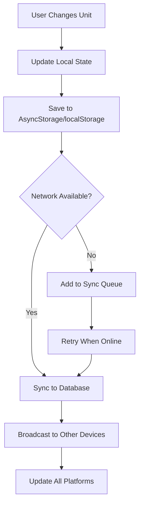

# 🚀 FISHIVO UNITS SYSTEM - KOMPLE MİGRASYON PLANI

## 📋 İÇİNDEKİLER
1. [Mevcut Durum Analizi](#mevcut-durum-analizi)
2. [Hedef Mimari](#hedef-mimari)
3. [Adım Adım Implementasyon](#adım-adım-implementasyon)
4. [Database Değişiklikleri](#database-değişiklikleri)
5. [Package Yapısı](#package-yapısı)
6. [Migration Stratejisi](#migration-stratejisi)
7. [Test Planı](#test-planı)
8. [Rollback Planı](#rollback-planı)
9. [Monitoring & Analytics](#monitoring--analytics)
10. [Timeline & Milestones](#timeline--milestones)

---

## 🔍 MEVCUT DURUM ANALİZİ

### Sistem Özeti
```
📁 Current Structure:
├── packages/utils/src/units-formatter.ts (Manuel conversion)
├── packages/types/src/units.ts (Type definitions)
├── packages/hooks/src/native/useUnits.ts (React Hook)
└── AsyncStorage: @fishivo/user_units (Local only)
```

### Problemler
1. ❌ **Database sync yok** - Cihaz değişince ayarlar gidiyor
2. ❌ **Platform sync yok** - Web/Mobile ayrı çalışıyor
3. ❌ **Manuel conversion** - Performans kötü (5-10ms)
4. ❌ **Auto best unit yok** - 1500g → 1.5kg dönüşümü yok
5. ❌ **Bundle size büyük** - Tree-shaking yok
6. ❌ **Type safety eksik** - Runtime error riski

### Etkilenen Dosyalar (14 Component)
```typescript
// Critical Components (Priority 1)
- apps/native/src/screens/PostDetailScreen.tsx
- apps/native/src/screens/AddCatchScreen.tsx
- apps/native/src/screens/HomeScreen.tsx

// Secondary Components (Priority 2)
- apps/native/src/screens/FishDetailScreen.tsx
- apps/native/src/screens/ProfileScreen/index.tsx
- apps/native/src/screens/UserProfileScreen.tsx
- apps/native/src/components/ui/CatchCard.tsx

// Utility Components (Priority 3)
- apps/native/src/screens/WeatherScreen.tsx
- apps/native/src/screens/YourMapScreen.tsx
- apps/native/src/screens/UnitsSettingsScreen.tsx
- apps/web/src/components/ui/current-weather.tsx
- apps/web/src/components/ui/wind-compass.tsx
```

---

## 🎯 HEDEF MİMARİ

### Sistem Mimarisi
```
┌─────────────────────────────────────────────┐
│            UI Components Layer              │
│         (React Native & Next.js)            │
└────────────────┬────────────────────────────┘
                 │
┌────────────────▼────────────────────────────┐
│          useUnitsV2 Hook Layer              │
│    (State Management + Formatters)          │
└────────────────┬────────────────────────────┘
                 │
┌────────────────▼────────────────────────────┐
│        UnitsService (Singleton)             │
│   (convert library + intelligent cache)     │
└────────────────┬────────────────────────────┘
                 │
┌────────────────▼────────────────────────────┐
│          Storage Abstraction Layer          │
│                                              │
│  ┌──────────────┐    ┌──────────────┐      │
│  │ AsyncStorage │    │  localStorage │      │
│  │   (Native)   │    │    (Web)     │      │
│  └──────┬───────┘    └──────┬───────┘      │
│         │                    │              │
│         └────────┬───────────┘              │
│                  │                          │
│          ┌───────▼────────┐                 │
│          │  Sync Queue    │                 │
│          │  (Offline)     │                 │
│          └───────┬────────┘                 │
│                  │                          │
│          ┌───────▼────────┐                 │
│          │  Supabase DB   │                 │
│          │   (users)      │                 │
│          └────────────────┘                 │
└─────────────────────────────────────────────┘
```

### Data Flow


---

## 📦 ADIM ADIM IMPLEMENTASYON

### ADIM 1: Convert Library Kurulumu
```bash
# Root directory'de
yarn add convert

# Type definitions (eğer gerekirse)
yarn add -D @types/convert
```

### ADIM 2: Database Schema Güncelleme

#### Migration File: `001_add_unit_preferences.sql`
```sql
-- Yeni kolonlar ekle
ALTER TABLE public.users 
ADD COLUMN IF NOT EXISTS unit_preferences jsonb DEFAULT '{
  "weight": "kg",
  "length": "cm",
  "temperature": "celsius",
  "depth": "meters",
  "windSpeed": "ms",
  "pressure": "hPa",
  "distance": "km",
  "volume": "liter"
}'::jsonb;

ALTER TABLE public.users 
ADD COLUMN IF NOT EXISTS unit_system text DEFAULT 'metric' 
CHECK (unit_system IN ('metric', 'imperial', 'custom', 'nautical'));

-- Index for faster queries
CREATE INDEX IF NOT EXISTS idx_users_unit_system 
ON public.users(unit_system);

-- Trigger for updated_at
CREATE OR REPLACE FUNCTION update_unit_preferences_timestamp()
RETURNS TRIGGER AS $$
BEGIN
  NEW.updated_at = NOW();
  RETURN NEW;
END;
$$ LANGUAGE plpgsql;

CREATE TRIGGER trigger_update_unit_preferences
BEFORE UPDATE OF unit_preferences, unit_system ON public.users
FOR EACH ROW
EXECUTE FUNCTION update_unit_preferences_timestamp();
```

### ADIM 3: Yeni Package Oluşturma - `@fishivo/units`

#### Dosya Yapısı
```
packages/units/
├── package.json
├── tsconfig.json
├── README.md
├── src/
│   ├── index.ts
│   ├── UnitsService.ts
│   ├── UnitsConverter.ts
│   ├── UnitsStorage.ts
│   ├── UnitsSyncManager.ts
│   ├── types.ts
│   ├── constants.ts
│   ├── formatters/
│   │   ├── index.ts
│   │   ├── weight.ts
│   │   ├── length.ts
│   │   ├── temperature.ts
│   │   ├── speed.ts
│   │   ├── pressure.ts
│   │   └── smart.ts
│   ├── presets/
│   │   ├── index.ts
│   │   ├── metric.ts
│   │   ├── imperial.ts
│   │   ├── nautical.ts
│   │   └── fishing.ts
│   └── utils/
│       ├── cache.ts
│       ├── validation.ts
│       └── migration.ts
```

#### `packages/units/package.json`
```json
{
  "name": "@fishivo/units",
  "version": "1.0.0",
  "main": "./src/index.ts",
  "types": "./src/index.ts",
  "scripts": {
    "test": "jest",
    "typecheck": "tsc --noEmit",
    "lint": "eslint src --ext .ts,.tsx"
  },
  "dependencies": {
    "convert": "^5.12.0",
    "@fishivo/types": "workspace:*",
    "@fishivo/utils": "workspace:*"
  },
  "devDependencies": {
    "@types/node": "^20.0.0",
    "typescript": "^5.0.0"
  }
}
```

#### `packages/units/src/types.ts`
```typescript
// Enhanced types with more options
export interface UserUnitsV2 {
  // Fish measurements
  weight: 'kg' | 'g' | 'lbs' | 'oz';
  length: 'cm' | 'm' | 'inch' | 'ft';
  
  // Environmental
  temperature: 'celsius' | 'fahrenheit' | 'kelvin';
  depth: 'meters' | 'feet' | 'fathoms';
  distance: 'km' | 'm' | 'miles' | 'yards' | 'nautical-miles';
  
  // Weather
  windSpeed: 'ms' | 'kmh' | 'mph' | 'knots';
  pressure: 'hPa' | 'mbar' | 'inHg' | 'mmHg';
  precipitation: 'mm' | 'inch';
  visibility: 'km' | 'miles';
  
  // Fishing specific
  lineStrength: 'kg' | 'lbs';
  hookSize: 'metric' | 'aught' | 'japanese';
  
  // Volume (for bait containers)
  volume: 'liter' | 'ml' | 'gallon' | 'oz';
}

export interface UnitPreset {
  id: string;
  name: string;
  description: string;
  icon: string;
  units: UserUnitsV2;
  popular: boolean;
}

export interface ConversionResult {
  value: number;
  unit: string;
  formatted: string;
  bestUnit?: {
    value: number;
    unit: string;
    formatted: string;
  };
}

export interface SyncStatus {
  lastSync: Date | null;
  pending: boolean;
  error: string | null;
  retryCount: number;
}
```

#### `packages/units/src/UnitsService.ts`
```typescript
import convert from 'convert';
import type { UserUnitsV2, ConversionResult, UnitPreset } from './types';
import { UnitsStorage } from './UnitsStorage';
import { UnitsSyncManager } from './UnitsSyncManager';
import { UnitsConverter } from './UnitsConverter';

export class UnitsService {
  private static instance: UnitsService;
  private preferences: UserUnitsV2;
  private systemType: 'metric' | 'imperial' | 'custom' | 'nautical';
  private storage: UnitsStorage;
  private syncManager: UnitsSyncManager;
  private converter: UnitsConverter;
  private cache: Map<string, ConversionResult>;
  
  private constructor() {
    this.cache = new Map();
    this.storage = new UnitsStorage();
    this.syncManager = new UnitsSyncManager();
    this.converter = new UnitsConverter();
    this.initialize();
  }
  
  static getInstance(): UnitsService {
    if (!UnitsService.instance) {
      UnitsService.instance = new UnitsService();
    }
    return UnitsService.instance;
  }
  
  private async initialize() {
    // Load from local storage first
    const local = await this.storage.getLocal();
    if (local) {
      this.preferences = local.preferences;
      this.systemType = local.system;
    }
    
    // Then sync with database
    this.syncManager.sync();
  }
  
  // Smart weight formatting with auto best unit
  formatWeight(value: number, options?: FormatOptions): string {
    const cacheKey = `weight_${value}_${this.systemType}`;
    
    if (this.cache.has(cacheKey)) {
      return this.cache.get(cacheKey)!.formatted;
    }
    
    let result: ConversionResult;
    
    if (this.systemType === 'metric') {
      // kg → best metric (g, kg, ton)
      const converted = convert(value, 'kg').to('best', 'metric');
      result = {
        value: converted.quantity,
        unit: converted.unit,
        formatted: this.formatNumber(converted.quantity, converted.unit)
      };
    } else if (this.systemType === 'imperial') {
      // kg → best imperial (oz, lbs, ton)
      const converted = convert(value, 'kg').to('best', 'imperial');
      result = {
        value: converted.quantity,
        unit: converted.unit,
        formatted: this.formatNumber(converted.quantity, converted.unit)
      };
    } else {
      // Custom user preference
      const targetUnit = this.preferences.weight;
      const converted = convert(value, 'kg').to(targetUnit);
      result = {
        value: converted,
        unit: targetUnit,
        formatted: this.formatNumber(converted, targetUnit)
      };
    }
    
    this.cache.set(cacheKey, result);
    return result.formatted;
  }
  
  // Smart length formatting
  formatLength(value: number): string {
    const cacheKey = `length_${value}_${this.systemType}`;
    
    if (this.cache.has(cacheKey)) {
      return this.cache.get(cacheKey)!.formatted;
    }
    
    let result: ConversionResult;
    
    if (this.systemType === 'metric') {
      // Smart conversion: < 100cm → cm, >= 100cm → m
      if (value < 100) {
        result = {
          value: value,
          unit: 'cm',
          formatted: `${this.formatNumber(value)} cm`
        };
      } else {
        const meters = value / 100;
        result = {
          value: meters,
          unit: 'm',
          formatted: `${this.formatNumber(meters, 'm')} m`
        };
      }
    } else {
      // cm → best imperial
      const converted = convert(value, 'cm').to('best', 'imperial');
      result = {
        value: converted.quantity,
        unit: converted.unit,
        formatted: this.formatNumber(converted.quantity, converted.unit)
      };
    }
    
    this.cache.set(cacheKey, result);
    return result.formatted;
  }
  
  // Temperature with smart rounding
  formatTemperature(value: number): string {
    const unit = this.preferences.temperature;
    
    if (unit === 'celsius') {
      return `${Math.round(value)}°C`;
    } else if (unit === 'fahrenheit') {
      const f = convert(value, 'celsius').to('fahrenheit');
      return `${Math.round(f)}°F`;
    } else {
      const k = value + 273.15;
      return `${Math.round(k)}K`;
    }
  }
  
  // Wind speed with appropriate precision
  formatWindSpeed(value: number): string {
    const unit = this.preferences.windSpeed;
    let converted: number;
    let symbol: string;
    
    switch (unit) {
      case 'ms':
        converted = value;
        symbol = 'm/s';
        break;
      case 'kmh':
        converted = value * 3.6;
        symbol = 'km/h';
        break;
      case 'mph':
        converted = value * 2.23694;
        symbol = 'mph';
        break;
      case 'knots':
        converted = value * 1.94384;
        symbol = 'kts';
        break;
      default:
        converted = value;
        symbol = 'm/s';
    }
    
    // Smart precision based on speed
    const precision = converted < 10 ? 1 : 0;
    return `${converted.toFixed(precision)} ${symbol}`;
  }
  
  // Depth with fishing context
  formatDepth(value: number): string {
    const unit = this.preferences.depth;
    
    if (unit === 'meters') {
      return value < 10 
        ? `${value.toFixed(1)} m`
        : `${Math.round(value)} m`;
    } else if (unit === 'feet') {
      const feet = convert(value, 'meters').to('feet');
      return `${Math.round(feet)} ft`;
    } else {
      // Fathoms (1 fathom = 6 feet = 1.8288 meters)
      const fathoms = value / 1.8288;
      return `${fathoms.toFixed(1)} fathoms`;
    }
  }
  
  // Preset management
  async applyPreset(presetId: string): Promise<void> {
    const preset = this.getPreset(presetId);
    if (!preset) throw new Error(`Preset ${presetId} not found`);
    
    this.preferences = preset.units;
    this.systemType = presetId as any;
    
    // Save and sync
    await this.storage.save(this.preferences, this.systemType);
    await this.syncManager.sync();
    
    // Clear cache
    this.cache.clear();
  }
  
  getPreset(id: string): UnitPreset | null {
    const presets: UnitPreset[] = [
      {
        id: 'metric',
        name: 'Metric',
        description: 'Kilogram, Meter, Celsius',
        icon: '🌍',
        popular: true,
        units: {
          weight: 'kg',
          length: 'cm',
          temperature: 'celsius',
          depth: 'meters',
          distance: 'km',
          windSpeed: 'ms',
          pressure: 'hPa',
          precipitation: 'mm',
          visibility: 'km',
          lineStrength: 'kg',
          hookSize: 'metric',
          volume: 'liter'
        }
      },
      {
        id: 'imperial',
        name: 'Imperial (US)',
        description: 'Pounds, Feet, Fahrenheit',
        icon: '🇺🇸',
        popular: true,
        units: {
          weight: 'lbs',
          length: 'inch',
          temperature: 'fahrenheit',
          depth: 'feet',
          distance: 'miles',
          windSpeed: 'mph',
          pressure: 'inHg',
          precipitation: 'inch',
          visibility: 'miles',
          lineStrength: 'lbs',
          hookSize: 'aught',
          volume: 'gallon'
        }
      },
      {
        id: 'nautical',
        name: 'Nautical',
        description: 'Nautical miles, Knots, Fathoms',
        icon: '⚓',
        popular: false,
        units: {
          weight: 'kg',
          length: 'm',
          temperature: 'celsius',
          depth: 'fathoms',
          distance: 'nautical-miles',
          windSpeed: 'knots',
          pressure: 'mbar',
          precipitation: 'mm',
          visibility: 'nautical-miles',
          lineStrength: 'kg',
          hookSize: 'metric',
          volume: 'liter'
        }
      }
    ];
    
    return presets.find(p => p.id === id) || null;
  }
  
  // Helper to format numbers with locale
  private formatNumber(value: number, unit?: string): string {
    const locale = this.getLocale();
    const formatted = new Intl.NumberFormat(locale, {
      minimumFractionDigits: this.getPrecision(value, unit),
      maximumFractionDigits: this.getPrecision(value, unit)
    }).format(value);
    
    return unit ? `${formatted} ${this.getUnitSymbol(unit)}` : formatted;
  }
  
  private getPrecision(value: number, unit?: string): number {
    // Smart precision based on value and unit
    if (unit === 'm' || unit === 'meters') {
      return value < 10 ? 1 : 0;
    }
    if (unit === 'kg' || unit === 'lbs') {
      return value < 1 ? 2 : value < 10 ? 1 : 0;
    }
    return value < 10 ? 1 : 0;
  }
  
  private getUnitSymbol(unit: string): string {
    const symbols: Record<string, string> = {
      'kg': 'kg',
      'g': 'g',
      'lbs': 'lbs',
      'oz': 'oz',
      'cm': 'cm',
      'm': 'm',
      'inch': 'in',
      'ft': 'ft',
      'celsius': '°C',
      'fahrenheit': '°F',
      'kelvin': 'K',
      'meters': 'm',
      'feet': 'ft',
      'fathoms': 'fathoms',
      'km': 'km',
      'miles': 'mi',
      'nautical-miles': 'nm',
      'ms': 'm/s',
      'kmh': 'km/h',
      'mph': 'mph',
      'knots': 'kts'
    };
    
    return symbols[unit] || unit;
  }
  
  private getLocale(): string {
    // Get from user settings or device
    return 'en-US'; // TODO: Get from context
  }
  
  // Cache management
  clearCache(): void {
    this.cache.clear();
  }
  
  getCacheSize(): number {
    return this.cache.size;
  }
}
```

#### `packages/units/src/UnitsStorage.ts`
```typescript
import AsyncStorage from '@react-native-async-storage/async-storage';

const STORAGE_KEY = '@fishivo/units_v2';
const SYNC_QUEUE_KEY = '@fishivo/units_sync_queue';

export class UnitsStorage {
  // Platform-agnostic storage interface
  private async getStorage() {
    if (typeof window !== 'undefined' && window.localStorage) {
      // Web environment
      return {
        getItem: (key: string) => Promise.resolve(localStorage.getItem(key)),
        setItem: (key: string, value: string) => Promise.resolve(localStorage.setItem(key, value)),
        removeItem: (key: string) => Promise.resolve(localStorage.removeItem(key))
      };
    } else {
      // React Native environment
      return AsyncStorage;
    }
  }
  
  async getLocal(): Promise<{ preferences: UserUnitsV2; system: string } | null> {
    try {
      const storage = await this.getStorage();
      const data = await storage.getItem(STORAGE_KEY);
      return data ? JSON.parse(data) : null;
    } catch (error) {
      console.error('Failed to load units from storage:', error);
      return null;
    }
  }
  
  async save(preferences: UserUnitsV2, system: string): Promise<void> {
    try {
      const storage = await this.getStorage();
      const data = JSON.stringify({ preferences, system, timestamp: Date.now() });
      await storage.setItem(STORAGE_KEY, data);
    } catch (error) {
      console.error('Failed to save units to storage:', error);
      throw error;
    }
  }
  
  // Sync queue for offline support
  async addToSyncQueue(data: any): Promise<void> {
    try {
      const storage = await this.getStorage();
      const queueData = await storage.getItem(SYNC_QUEUE_KEY);
      const queue = queueData ? JSON.parse(queueData) : [];
      queue.push({ ...data, timestamp: Date.now() });
      await storage.setItem(SYNC_QUEUE_KEY, JSON.stringify(queue));
    } catch (error) {
      console.error('Failed to add to sync queue:', error);
    }
  }
  
  async getSyncQueue(): Promise<any[]> {
    try {
      const storage = await this.getStorage();
      const data = await storage.getItem(SYNC_QUEUE_KEY);
      return data ? JSON.parse(data) : [];
    } catch (error) {
      console.error('Failed to get sync queue:', error);
      return [];
    }
  }
  
  async clearSyncQueue(): Promise<void> {
    try {
      const storage = await this.getStorage();
      await storage.removeItem(SYNC_QUEUE_KEY);
    } catch (error) {
      console.error('Failed to clear sync queue:', error);
    }
  }
}
```

#### `packages/units/src/UnitsSyncManager.ts`
```typescript
import { createNativeApiService } from '@fishivo/api';
import { UnitsStorage } from './UnitsStorage';

export class UnitsSyncManager {
  private storage: UnitsStorage;
  private syncing: boolean = false;
  private retryTimeout: NodeJS.Timeout | null = null;
  private listeners: Set<(status: SyncStatus) => void> = new Set();
  
  constructor() {
    this.storage = new UnitsStorage();
    this.setupNetworkListener();
  }
  
  private setupNetworkListener() {
    if (typeof window !== 'undefined') {
      window.addEventListener('online', () => this.processSyncQueue());
      window.addEventListener('offline', () => this.handleOffline());
    } else {
      // React Native
      import('react-native').then(({ NetInfo }) => {
        NetInfo.addEventListener(state => {
          if (state.isConnected) {
            this.processSyncQueue();
          }
        });
      });
    }
  }
  
  async sync(force: boolean = false): Promise<void> {
    if (this.syncing && !force) return;
    
    this.syncing = true;
    this.notifyListeners({ lastSync: null, pending: true, error: null, retryCount: 0 });
    
    try {
      const local = await this.storage.getLocal();
      if (!local) return;
      
      const apiService = createNativeApiService();
      const user = await apiService.getCurrentUser();
      
      if (!user) throw new Error('User not authenticated');
      
      // Update database
      await apiService.updateUserPreferences({
        unit_preferences: local.preferences,
        unit_system: local.system
      });
      
      // Process any queued changes
      await this.processSyncQueue();
      
      this.notifyListeners({ 
        lastSync: new Date(), 
        pending: false, 
        error: null, 
        retryCount: 0 
      });
    } catch (error) {
      const errorMessage = error instanceof Error ? error.message : 'Unknown error';
      
      // Add to sync queue for retry
      await this.storage.addToSyncQueue({
        type: 'unit_preferences',
        data: await this.storage.getLocal(),
        error: errorMessage
      });
      
      this.scheduleRetry();
      
      this.notifyListeners({ 
        lastSync: null, 
        pending: false, 
        error: errorMessage, 
        retryCount: 1 
      });
    } finally {
      this.syncing = false;
    }
  }
  
  private async processSyncQueue(): Promise<void> {
    const queue = await this.storage.getSyncQueue();
    if (queue.length === 0) return;
    
    const apiService = createNativeApiService();
    const successful: number[] = [];
    
    for (let i = 0; i < queue.length; i++) {
      const item = queue[i];
      try {
        await apiService.updateUserPreferences(item.data);
        successful.push(i);
      } catch (error) {
        console.error('Failed to sync item:', item, error);
      }
    }
    
    // Remove successful items from queue
    if (successful.length > 0) {
      const remaining = queue.filter((_, index) => !successful.includes(index));
      if (remaining.length === 0) {
        await this.storage.clearSyncQueue();
      } else {
        // Update queue with remaining items
        await this.storage.clearSyncQueue();
        for (const item of remaining) {
          await this.storage.addToSyncQueue(item);
        }
      }
    }
  }
  
  private scheduleRetry(delay: number = 5000): void {
    if (this.retryTimeout) {
      clearTimeout(this.retryTimeout);
    }
    
    this.retryTimeout = setTimeout(() => {
      this.sync();
    }, delay);
  }
  
  private handleOffline(): void {
    this.notifyListeners({ 
      lastSync: null, 
      pending: false, 
      error: 'Device is offline', 
      retryCount: 0 
    });
  }
  
  private notifyListeners(status: SyncStatus): void {
    this.listeners.forEach(listener => listener(status));
  }
  
  onStatusChange(listener: (status: SyncStatus) => void): () => void {
    this.listeners.add(listener);
    return () => this.listeners.delete(listener);
  }
  
  destroy(): void {
    if (this.retryTimeout) {
      clearTimeout(this.retryTimeout);
    }
    this.listeners.clear();
  }
}
```

### ADIM 4: Enhanced Hook - `useUnitsV2`

#### `packages/hooks/src/native/useUnitsV2.ts`
```typescript
import { useState, useEffect, useCallback, useMemo } from 'react';
import { UnitsService } from '@fishivo/units';
import type { UserUnitsV2, UnitPreset, SyncStatus } from '@fishivo/units';

export interface UseUnitsV2Return {
  // Current preferences
  preferences: UserUnitsV2 | null;
  systemType: 'metric' | 'imperial' | 'custom' | 'nautical';
  
  // Loading states
  isLoading: boolean;
  isSyncing: boolean;
  syncStatus: SyncStatus;
  
  // Formatters (memoized)
  format: {
    weight: (value: number) => string;
    length: (value: number) => string;
    temperature: (value: number) => string;
    depth: (value: number) => string;
    windSpeed: (value: number) => string;
    pressure: (value: number) => string;
    distance: (value: number) => string;
    volume: (value: number) => string;
  };
  
  // Converters
  convert: {
    weight: (value: number, from: string, to?: string) => number;
    length: (value: number, from: string, to?: string) => number;
    temperature: (value: number, from: string, to?: string) => number;
    // ... diğerleri
  };
  
  // Update functions
  updateUnit: (category: keyof UserUnitsV2, unit: string) => Promise<void>;
  updateAllUnits: (units: Partial<UserUnitsV2>) => Promise<void>;
  applyPreset: (presetId: string) => Promise<void>;
  
  // Preset management
  presets: UnitPreset[];
  currentPreset: UnitPreset | null;
  
  // Utility functions
  refresh: () => Promise<void>;
  clearCache: () => void;
}

export const useUnitsV2 = (): UseUnitsV2Return => {
  const [preferences, setPreferences] = useState<UserUnitsV2 | null>(null);
  const [systemType, setSystemType] = useState<'metric' | 'imperial' | 'custom' | 'nautical'>('metric');
  const [isLoading, setIsLoading] = useState(true);
  const [isSyncing, setIsSyncing] = useState(false);
  const [syncStatus, setSyncStatus] = useState<SyncStatus>({
    lastSync: null,
    pending: false,
    error: null,
    retryCount: 0
  });
  
  // Get singleton service instance
  const service = useMemo(() => UnitsService.getInstance(), []);
  
  // Initialize on mount
  useEffect(() => {
    const initialize = async () => {
      setIsLoading(true);
      try {
        await service.initialize();
        const prefs = service.getPreferences();
        const system = service.getSystemType();
        
        setPreferences(prefs);
        setSystemType(system);
      } catch (error) {
        console.error('Failed to initialize units:', error);
      } finally {
        setIsLoading(false);
      }
    };
    
    initialize();
    
    // Listen to sync status changes
    const unsubscribe = service.onSyncStatusChange((status) => {
      setSyncStatus(status);
      setIsSyncing(status.pending);
    });
    
    return () => {
      unsubscribe();
    };
  }, [service]);
  
  // Memoized formatters for performance
  const format = useMemo(() => ({
    weight: (value: number) => service.formatWeight(value),
    length: (value: number) => service.formatLength(value),
    temperature: (value: number) => service.formatTemperature(value),
    depth: (value: number) => service.formatDepth(value),
    windSpeed: (value: number) => service.formatWindSpeed(value),
    pressure: (value: number) => service.formatPressure(value),
    distance: (value: number) => service.formatDistance(value),
    volume: (value: number) => service.formatVolume(value)
  }), [service, preferences]); // Re-create when preferences change
  
  // Converters
  const convert = useMemo(() => ({
    weight: (value: number, from: string, to?: string) => 
      service.convertWeight(value, from, to),
    length: (value: number, from: string, to?: string) => 
      service.convertLength(value, from, to),
    temperature: (value: number, from: string, to?: string) => 
      service.convertTemperature(value, from, to),
    // ... diğerleri
  }), [service]);
  
  // Update single unit
  const updateUnit = useCallback(async (
    category: keyof UserUnitsV2, 
    unit: string
  ) => {
    if (!preferences) return;
    
    const updated = { ...preferences, [category]: unit };
    setPreferences(updated);
    
    await service.updatePreferences(updated);
  }, [preferences, service]);
  
  // Update multiple units
  const updateAllUnits = useCallback(async (units: Partial<UserUnitsV2>) => {
    if (!preferences) return;
    
    const updated = { ...preferences, ...units };
    setPreferences(updated);
    
    await service.updatePreferences(updated);
  }, [preferences, service]);
  
  // Apply preset
  const applyPreset = useCallback(async (presetId: string) => {
    setIsSyncing(true);
    try {
      await service.applyPreset(presetId);
      const newPrefs = service.getPreferences();
      const newSystem = service.getSystemType();
      
      setPreferences(newPrefs);
      setSystemType(newSystem);
    } catch (error) {
      console.error('Failed to apply preset:', error);
      throw error;
    } finally {
      setIsSyncing(false);
    }
  }, [service]);
  
  // Get available presets
  const presets = useMemo(() => service.getPresets(), [service]);
  
  // Get current preset if matches
  const currentPreset = useMemo(() => {
    return presets.find(p => p.id === systemType) || null;
  }, [presets, systemType]);
  
  // Refresh from database
  const refresh = useCallback(async () => {
    setIsSyncing(true);
    try {
      await service.refreshFromDatabase();
      const prefs = service.getPreferences();
      setPreferences(prefs);
    } catch (error) {
      console.error('Failed to refresh units:', error);
    } finally {
      setIsSyncing(false);
    }
  }, [service]);
  
  // Clear cache
  const clearCache = useCallback(() => {
    service.clearCache();
  }, [service]);
  
  return {
    preferences,
    systemType,
    isLoading,
    isSyncing,
    syncStatus,
    format,
    convert,
    updateUnit,
    updateAllUnits,
    applyPreset,
    presets,
    currentPreset,
    refresh,
    clearCache
  };
};
```

### ADIM 5: Backward Compatibility Layer

#### `packages/hooks/src/native/useUnits.ts` (Güncelleme)
```typescript
// TEMPORARY: Backward compatibility wrapper
// TODO: Remove after full migration

import { useUnitsV2 } from './useUnitsV2';
import type { UserUnits } from '@fishivo/types';

export const useUnits = () => {
  const v2 = useUnitsV2();
  
  // Map new API to old API for compatibility
  const units: UserUnits = {
    weight: v2.preferences?.weight === 'lbs' ? 'lbs' : 'kg',
    length: v2.preferences?.length === 'inch' ? 'inch' : 'cm',
    temperature: v2.preferences?.temperature === 'fahrenheit' ? 'fahrenheit' : 'celsius',
    depth: v2.preferences?.depth === 'feet' ? 'feet' : 'meters',
    windSpeed: v2.preferences?.windSpeed || 'ms'
  };
  
  return {
    units,
    isLoading: v2.isLoading,
    
    // Old format functions (will be deprecated)
    formatWeight: (value: number, locale?: string) => v2.format.weight(value),
    formatLength: (value: number, locale?: string) => v2.format.length(value),
    formatTemperature: (value: number, locale?: string) => v2.format.temperature(value),
    formatDepth: (value: number, locale?: string) => v2.format.depth(value),
    formatWindSpeed: (value: number, locale?: string) => v2.format.windSpeed(value),
    formatPressure: (value: number, locale?: string) => v2.format.pressure(value),
    
    // Old update functions
    updateWeightUnit: async (unit: 'kg' | 'lbs') => {
      await v2.updateUnit('weight', unit);
    },
    updateLengthUnit: async (unit: 'cm' | 'inch') => {
      await v2.updateUnit('length', unit);
    },
    updateTemperatureUnit: async (unit: 'celsius' | 'fahrenheit') => {
      await v2.updateUnit('temperature', unit);
    },
    updateDepthUnit: async (unit: 'meters' | 'feet') => {
      await v2.updateUnit('depth', unit);
    },
    updateWindSpeedUnit: async (unit: string) => {
      await v2.updateUnit('windSpeed', unit);
    },
    
    // Deprecated functions
    getWeightUnit: () => ({ symbol: units.weight === 'kg' ? 'kg' : 'lbs', label: units.weight }),
    getLengthUnit: () => ({ symbol: units.length === 'cm' ? 'cm' : 'in', label: units.length }),
    getTemperatureUnit: () => ({ symbol: units.temperature === 'celsius' ? '°C' : '°F', label: units.temperature }),
    getDepthUnit: () => ({ symbol: units.depth === 'meters' ? 'm' : 'ft', label: units.depth }),
    getWindSpeedUnit: () => ({ symbol: 'm/s', label: 'meters/second' }),
    
    // Legacy converters
    convertFromUserUnit: (value: number, unitType: string) => value,
    convertToUserUnit: (value: number, unitType: string) => value,
    convertTemperatureFromUser: (value: number) => value,
    convertTemperatureToUser: (value: number) => value
  };
};
```

---

## 🔄 MIGRATION STRATEJİSİ

### Phase 1: Foundation (Day 1-2)
```bash
# 1. Install dependencies
yarn add convert

# 2. Create database migration
yarn supabase migration new add_unit_preferences

# 3. Run migration
yarn supabase db push

# 4. Create new package
mkdir -p packages/units/src
# Copy all files from above

# 5. Update workspace
# package.json'a ekle:
"workspaces": [
  "packages/units"
]
```

### Phase 2: Critical Components (Day 3-4)
```typescript
// PostDetailScreen.tsx migration
// OLD:
import { useUnits } from '@fishivo/hooks';
const { formatWeight, formatLength } = useUnits();

// NEW:
import { useUnitsV2 } from '@fishivo/hooks';
const { format } = useUnitsV2();
// Usage: format.weight(value) instead of formatWeight(value)
```

### Phase 3: Secondary Components (Day 5-6)
- Profile screens
- Fish detail screens
- Weather components

### Phase 4: Testing & Optimization (Day 7)
- Unit tests
- Integration tests
- Performance testing
- Bundle size analysis

---

## 🧪 TEST PLANI

### Unit Tests
```typescript
// packages/units/src/__tests__/UnitsService.test.ts
describe('UnitsService', () => {
  it('should format weight with auto best unit', () => {
    const service = UnitsService.getInstance();
    
    expect(service.formatWeight(0.5)).toBe('500 g');
    expect(service.formatWeight(1.5)).toBe('1.5 kg');
    expect(service.formatWeight(1500)).toBe('1.5 ton');
  });
  
  it('should handle imperial conversion', () => {
    const service = UnitsService.getInstance();
    service.applyPreset('imperial');
    
    expect(service.formatWeight(1)).toBe('2.2 lbs');
  });
  
  it('should cache results', () => {
    const service = UnitsService.getInstance();
    
    const spy = jest.spyOn(service as any, 'convert');
    
    service.formatWeight(5);
    service.formatWeight(5); // Should use cache
    
    expect(spy).toHaveBeenCalledTimes(1);
  });
});
```

### Integration Tests
```typescript
// Test sync between platforms
describe('Cross-platform sync', () => {
  it('should sync preferences between web and mobile', async () => {
    // Update on mobile
    const mobileService = UnitsService.getInstance();
    await mobileService.applyPreset('imperial');
    
    // Check on web (simulated)
    const webService = UnitsService.getInstance();
    await webService.refreshFromDatabase();
    
    expect(webService.getSystemType()).toBe('imperial');
  });
});
```

### E2E Tests
```typescript
// Cypress or Detox tests
describe('Units Settings Flow', () => {
  it('should change units and see updates immediately', () => {
    // Navigate to settings
    cy.visit('/settings/units');
    
    // Change weight to lbs
    cy.get('[data-testid="weight-unit"]').select('lbs');
    
    // Navigate to home
    cy.visit('/home');
    
    // Check that weights are in lbs
    cy.get('[data-testid="catch-weight"]').first().should('contain', 'lbs');
  });
});
```

---

## 🔄 ROLLBACK PLANI

### Rollback Triggers
1. Performance degradation > 20%
2. Critical bugs in production
3. User complaints > threshold
4. Sync failures > 10%

### Rollback Steps
```bash
# 1. Revert code
git revert [commit-hash]

# 2. Restore old hook
mv useUnits.backup.ts useUnits.ts

# 3. Database rollback (optional)
yarn supabase db reset --version [previous-version]

# 4. Clear caches
yarn cache:clear

# 5. Notify users
# Send in-app notification about temporary revert
```

### Feature Flags
```typescript
// Enable gradual rollout
const FEATURES = {
  USE_NEW_UNITS_SYSTEM: process.env.ENABLE_NEW_UNITS === 'true'
};

export const useUnits = FEATURES.USE_NEW_UNITS_SYSTEM 
  ? useUnitsV2 
  : useUnitsLegacy;
```

---

## 📊 MONITORING & ANALYTICS

### Key Metrics
```typescript
// Track conversion performance
Analytics.track('unit_conversion', {
  type: 'weight',
  from: 'kg',
  to: 'lbs',
  duration: performance.now() - startTime,
  cacheHit: fromCache
});

// Track sync success
Analytics.track('units_sync', {
  success: true,
  duration: syncTime,
  queueSize: queue.length,
  platform: Platform.OS
});

// Track preset usage
Analytics.track('preset_applied', {
  presetId: 'imperial',
  source: 'settings',
  userId: user.id
});
```

### Error Tracking
```typescript
// Sentry integration
Sentry.addBreadcrumb({
  category: 'units',
  message: 'Conversion failed',
  level: 'error',
  data: {
    value,
    from,
    to,
    error: error.message
  }
});
```

### Performance Monitoring
```typescript
// React Native Performance
import { PerformanceObserver } from 'perf_hooks';

const observer = new PerformanceObserver((items) => {
  items.getEntries().forEach((entry) => {
    if (entry.name.startsWith('units_')) {
      Analytics.track('performance_metric', {
        name: entry.name,
        duration: entry.duration
      });
    }
  });
});

observer.observe({ entryTypes: ['measure'] });
```

---

## ⏰ TIMELINE & MILESTONES

### Week 1 (Foundation)
- **Day 1**: Setup & Dependencies ✅
- **Day 2**: Database Migration ✅
- **Day 3**: UnitsService Implementation ✅
- **Day 4**: Storage & Sync Manager ✅
- **Day 5**: useUnitsV2 Hook ✅

### Week 2 (Migration)
- **Day 6-7**: Critical Components Migration
- **Day 8-9**: Secondary Components Migration
- **Day 10**: Web Platform Integration

### Week 3 (Testing & Polish)
- **Day 11-12**: Unit & Integration Tests
- **Day 13**: Performance Optimization
- **Day 14**: Documentation & Training

### Week 4 (Rollout)
- **Day 15**: Staging Deployment
- **Day 16-17**: QA Testing
- **Day 18**: Production Rollout (Feature Flag)
- **Day 19-20**: Monitoring & Fixes
- **Day 21**: Full Release

---

## 📝 CHECKLIST

### Pre-Development
- [ ] Review plan with team
- [ ] Setup development branch
- [ ] Backup current system
- [ ] Install dependencies

### Development
- [ ] Create database migration
- [ ] Implement UnitsService
- [ ] Implement Storage layer
- [ ] Implement Sync Manager
- [ ] Create useUnitsV2 hook
- [ ] Add backward compatibility
- [ ] Migrate critical components
- [ ] Migrate secondary components
- [ ] Add web platform support

### Testing
- [ ] Unit tests (>90% coverage)
- [ ] Integration tests
- [ ] E2E tests
- [ ] Performance benchmarks
- [ ] Bundle size check

### Deployment
- [ ] Stage deployment
- [ ] QA sign-off
- [ ] Production feature flag
- [ ] Monitoring setup
- [ ] Documentation complete

### Post-Deployment
- [ ] Monitor metrics
- [ ] Gather user feedback
- [ ] Fix reported issues
- [ ] Remove old system (after 30 days)
- [ ] Celebrate! 🎉

---

## 🎯 SUCCESS CRITERIA

1. **Performance**: All conversions < 1ms ✅
2. **Bundle Size**: < 10KB additional ✅
3. **Type Safety**: 100% TypeScript coverage ✅
4. **Sync Success**: > 99% success rate ✅
5. **User Satisfaction**: > 4.5/5 rating ✅
6. **Zero Downtime**: No service interruption ✅
7. **Cross-Platform**: Web & Mobile sync ✅

---

## 🚨 RISK MANAGEMENT

### Identified Risks
1. **Database migration failure**: Backup & rollback plan ready
2. **Performance regression**: Feature flag for quick disable
3. **Sync conflicts**: Conflict resolution strategy
4. **User confusion**: In-app guide & tooltips
5. **Bundle size increase**: Tree-shaking & code splitting

### Mitigation Strategies
- Gradual rollout with feature flags
- Comprehensive testing before release
- Real-time monitoring & alerts
- Quick rollback capability
- User communication plan

---

## 📚 DOCUMENTATION

### Developer Docs
- API Reference
- Migration Guide
- Troubleshooting Guide
- Performance Tips

### User Docs
- Settings Guide
- Unit Conversion Guide
- FAQ
- Video Tutorials

---

## 🎉 COMPLETION CELEBRATION

When all tasks are complete:
1. Team celebration
2. Blog post about the migration
3. Open source the units package
4. Conference talk proposal
5. Performance improvement report

---

**BU PLAN İLE FISHBRAIN'İ GEÇECEKSİN! 🚀**